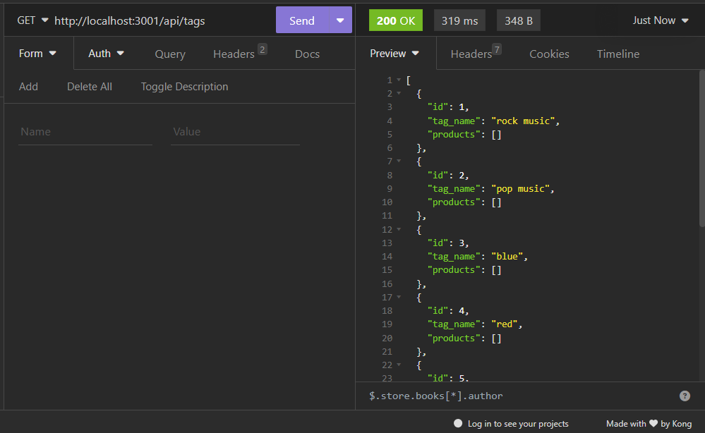
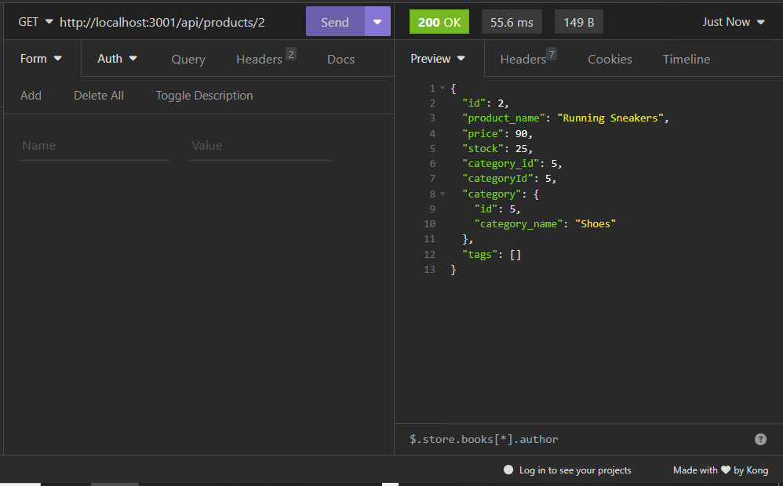
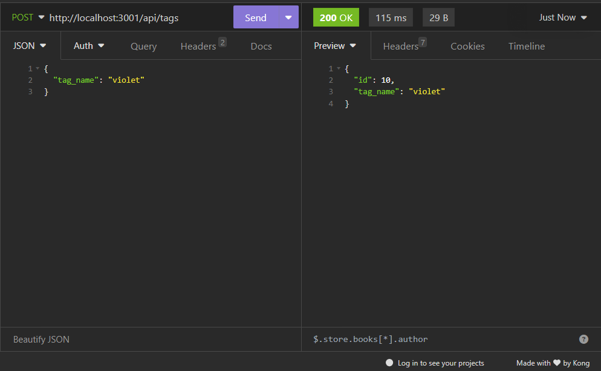
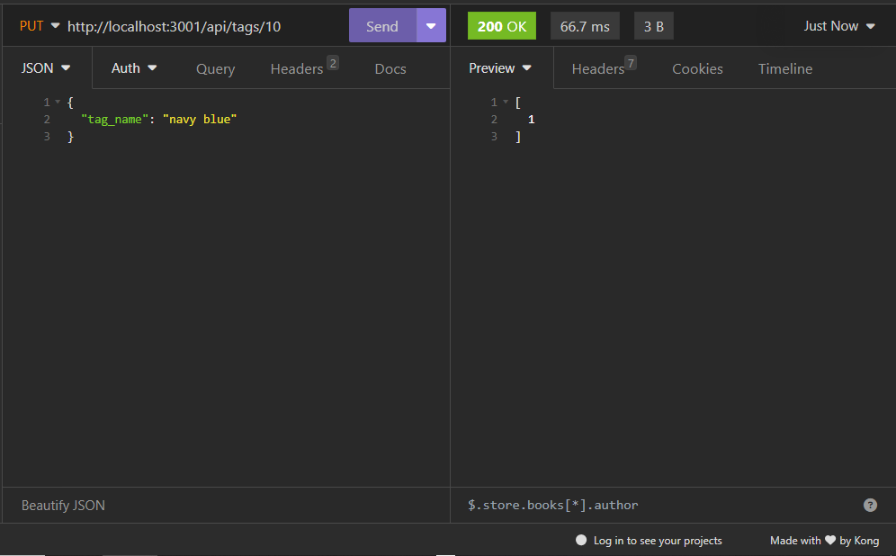
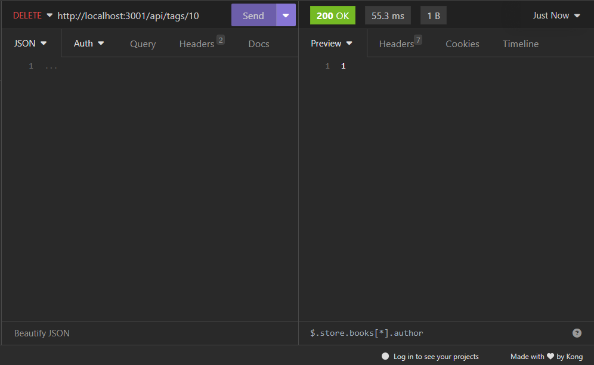

  # E-Commerce Back-End

  ## Description

  E-Commerce Back-End is an application that runs on the back-end using Node.js, MySQL, and Sequelize. It allows users to manage items for an e-commerce website by viewing all items in categories, products, and tags as well as add, update, and delete items.

  ## Table of Contents 

  - [Description](#description)

  - [Table of Contents](#table-of-contents)

  - [Installlation](#installlation)

  - [Usage](#usage)

  - [License](#license)

  - [Contributing](#contributing)

  - [Tests](#tests)

  - [Questions](#questions) 

  ## Installation

  This application requires that you have [Node.js](https://nodejs.org/en/), [MySQL shell](https://dev.mysql.com/downloads/installer/), [Insomnia](https://insomnia.rest/download), Express, and Sequelize. 
  
  Node can be installed from the link above or by typing `npm install -g node` in the terminal. 
  
  Insomnia can be installed from the link above.

  MySQL shell can be installed from the link above. Download the second option listed then follow the instructions listed in the [documentation at this link here](https://coding-boot-camp.github.io/full-stack/mysql/mysql-installation-guide). 
  
  The following dependencies can be installed by typing `npm i` in the integrated terminal after cloning or forking this repo.

  ## Usage

  ### Setup 

  The first step after installing all the required environments and modules, is open the folder called `db` and open an integrated terminal at schema.sql. Run `mysql -u root -p` then enter the password you set up for the MySQL shell. Next run `source schema.sql` and then `quit`. Close the terminal and return to root. Copy the folder `.env.EXAMPLE` and rename the copy as just `.env`. Fill out the variables with user and passoword created when installing MySQL shell. Next open an integrated terminal at server.js. Run `npm run seed` to fill the database with example data. run `npm start` and open Insomnia to use the application. 

  ### Instructions
  Type the following commands into the Insomnia address bar to get intended result.
  
  `< table_name >` can be replaced with `categories`, `products` or `tags`
  
  `< id >` can be replaced with the id of an existing item

  #### View all data 
    GET http://localhost:3001/api/<table_name> 

  #### View data by id 
    GET http://localhost:3001/api/<table_name>/<id>

  #### Create new data
    POST http://localhost:3001/api/<table_name>
     - Insert JSON or Form URL encoded data for new item
     - categories needs values for
        - id (optional)
        - category_name
     - products needs values for
        - id (optional)
        - product_name
        - price
        - stock
        - tagIds
     - tags needs values for
        - id (optional)
        - tag_name

  #### Update data for item with id
    PUT http://localhost:3001/api/<table_name>/<id>
    - Insert JSON or Form URL encoded data for new item (values are same as for create data)

  #### Delete data for item with id
    DELETE http://localhost:3001/api/<table_name>/<id>
  

 ### Full demo
 [video demo](./assets/demoVideo.webm)  
  ## License

  N/A

  ## Contributing

  There are no guidelines for contribution

  ## Tests

  N/A

  ## Questions

  - GitHub: [Kal-a11y](https://github.com/Kal-a11y/)
  - Email: N/A

  